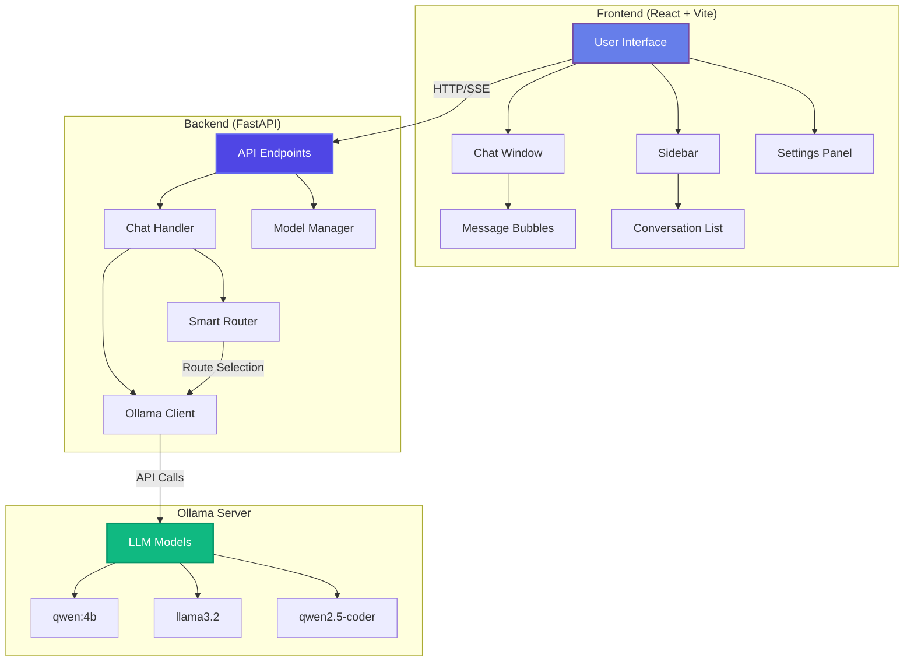
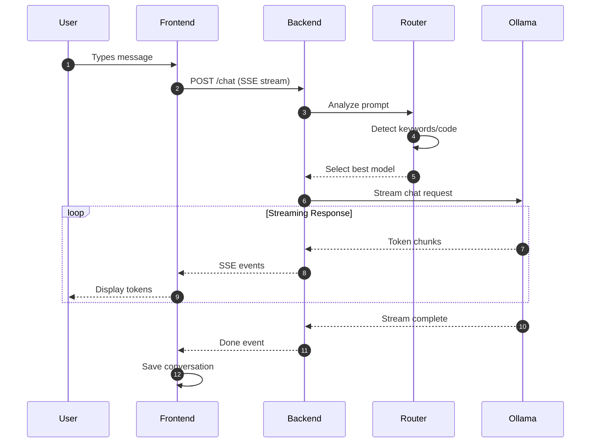
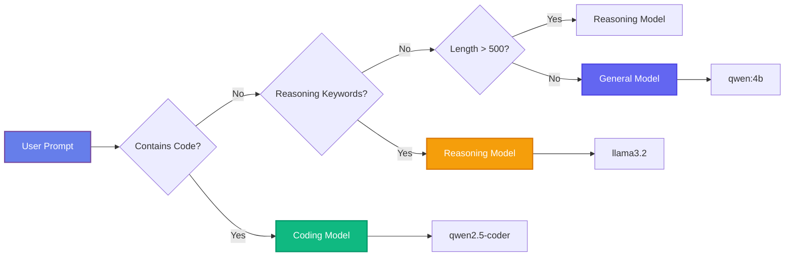
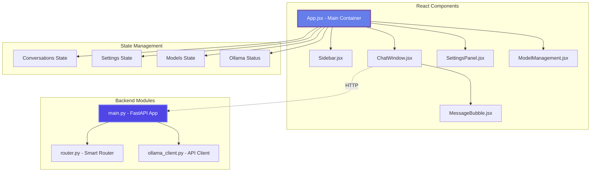
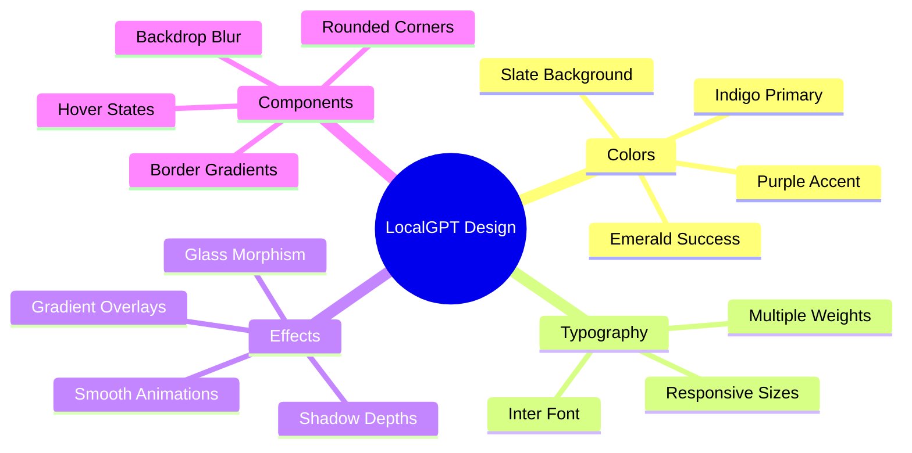
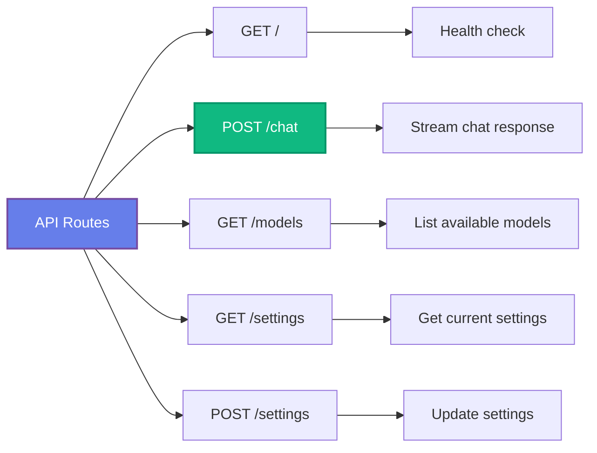
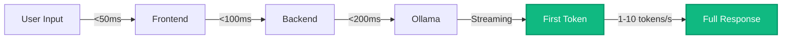

# 🤖 LocalGPT Control Center

<div align="center">


**A modern, full-stack web application for interacting with local LLMs via Ollama**

[Features](#-features) • [Architecture](#-architecture) • [Installation](#-installation) • [Usage](#-usage) • [Tech Stack](#-tech-stack)

</div>

---

## 📸 Preview

<div align="center">

### Modern, Beautiful Interface


*Beautiful gradient design with glass morphism effects and smooth animations*

</div>

---

## ✨ Features

<table>
<tr>
<td width="50%">

### 🎯 Smart Features
- **🤖 Intelligent Model Router** - Automatically selects the best model based on your prompt
- **💬 Real-time Streaming** - Watch responses generate in real-time with SSE
- **📝 Conversation Management** - Save, switch, and manage multiple conversations
- **🎨 Modern UI/UX** - Beautiful gradient design with smooth animations
- **⚡ Fast & Local** - All processing happens on your machine

</td>
<td width="50%">

### 🛠️ Technical Features
- **🔄 Hot Module Replacement** - Instant updates during development
- **📊 Model Management** - View and manage your Ollama models
- **⚙️ Customizable Settings** - Configure defaults and routing behavior
- **🌙 Dark Mode** - Eye-friendly interface (default)
- **📱 Responsive Design** - Works on desktop and tablets

</td>
</tr>
</table>

---

## 🏗️ Architecture

### System Overview



### Data Flow



### Smart Router Logic



---

## 📊 Component Architecture



---

## 🛠️ Tech Stack

<div align="center">

### Frontend Stack

| Technology | Purpose | Version |
|-----------|---------|---------|
| ⚛️ **React** | UI Framework | 18.2 |
| ⚡ **Vite** | Build Tool | 5.0 |
| 🎨 **Tailwind CSS** | Styling | 3.4 |
| 📝 **React Markdown** | Message Rendering | 9.0 |
| 🎯 **Lucide React** | Icons | 0.309 |
| 🎨 **Syntax Highlighter** | Code Display | 15.5 |

### Backend Stack

| Technology | Purpose | Version |
|-----------|---------|---------|
| 🚀 **FastAPI** | Web Framework | 0.115 |
| 🔷 **Pydantic** | Data Validation | 2.9 |
| 🌐 **HTTPX** | HTTP Client | 0.27 |
| ⚡ **Uvicorn** | ASGI Server | 0.32 |

### AI/ML Stack

| Technology | Purpose |
|-----------|---------|
| 🤖 **Ollama** | LLM Runtime |
| 🧠 **qwen:4b** | General Purpose Model |
| 💻 **llama3.2** | Reasoning Model |
| 👨‍💻 **qwen2.5-coder** | Code Generation Model |

</div>

---

## 🎨 UI/UX Features

### Design System



### Key UI Elements

- **🎨 Gradient Backgrounds**: Beautiful purple/indigo color schemes
- **✨ Glass Morphism**: Frosted glass effects with backdrop blur
- **🌊 Smooth Animations**: Fade-in, slide-in, and scale transitions
- **💫 Smart Scrolling**: Auto-scroll with smooth/instant modes
- **🎯 Status Indicators**: Animated connection status badges
- **📱 Responsive Layout**: Adapts to different screen sizes

---

## � Installation

### Prerequisites

- **Python 3.12+** (not 3.13/3.14 - compatibility issues)
- **Node.js 18+** and npm
- **Ollama** installed and running

### Step 1: Install Ollama

```bash
# macOS
brew install ollama

# Start Ollama service
ollama serve

# Pull models (in a new terminal)
ollama pull qwen:4b
ollama pull llama3.2
ollama pull qwen2.5-coder
```

### Step 2: Setup Backend

```bash
# Navigate to project
cd LocalGPT

# Create virtual environment
python3.12 -m venv backend/venv

# Activate virtual environment
source backend/venv/bin/activate  # macOS/Linux
# or
backend\venv\Scripts\activate     # Windows

# Install dependencies
cd backend
pip install -r requirements.txt
```

### Step 3: Setup Frontend

```bash
# Navigate to frontend
cd ../frontend

# Install dependencies
npm install
```

---

## 🎮 Usage

### Quick Start

#### Option 1: Automated Scripts (Recommended)

```bash
# Make scripts executable
chmod +x *.sh

# Setup everything
./setup.sh

# Start both servers
./start.sh
```

#### Option 2: Manual Start

**Terminal 1 - Backend:**
```bash
cd backend
source venv/bin/activate
python main.py
```

**Terminal 2 - Frontend:**
```bash
cd frontend
npm run dev
```

### Access the Application

1. **Frontend**: Open [http://localhost:5173](http://localhost:5173) or [http://localhost:5174](http://localhost:5174)
2. **Backend API**: [http://localhost:8000](http://localhost:8000)
3. **API Docs**: [http://localhost:8000/docs](http://localhost:8000/docs)

---

## 🎯 API Endpoints



### Endpoint Details

| Method | Endpoint | Description | Response |
|--------|----------|-------------|----------|
| `GET` | `/` | Health check | JSON status |
| `POST` | `/chat` | Stream chat responses | SSE stream |
| `GET` | `/models` | List Ollama models | JSON array |
| `GET` | `/settings` | Get user settings | JSON object |
| `POST` | `/settings` | Update settings | JSON object |
| `GET` | `/docs` | API documentation | Swagger UI |

---

## 📁 Project Structure

```
LocalGPT/
├── 📂 backend/
│   ├── 📂 venv/                # Python virtual environment
│   ├── 📄 main.py              # FastAPI application (279 lines)
│   ├── 📄 router.py            # Smart model router (160 lines)
│   ├── 📄 ollama_client.py     # Ollama API client (142 lines)
│   └── 📄 requirements.txt     # Python dependencies
│
├── 📂 frontend/
│   ├── 📂 src/
│   │   ├── 📂 components/
│   │   │   ├── App.jsx         # Main application
│   │   │   ├── ChatWindow.jsx  # Chat interface
│   │   │   ├── MessageBubble.jsx
│   │   │   ├── Sidebar.jsx
│   │   │   ├── SettingsPanel.jsx
│   │   │   └── ModelManagement.jsx
│   │   ├── 📄 main.jsx         # React entry point
│   │   └── 📄 index.css        # Global styles
│   ├── 📄 package.json
│   ├── 📄 vite.config.js
│   └── 📄 tailwind.config.js
│
├── 📂 docs/                    # Documentation
│   ├── QUICKSTART.md
│   ├── ARCHITECTURE.md
│   ├── CONFIGURATION.md
│   └── TROUBLESHOOTING.md
│
├── 📄 setup.sh                 # Automated setup script
├── 📄 start.sh                 # Start servers script
└── 📄 README.md                # You are here!
```

---

## 🔍 Smart Router Patterns

The intelligent router analyzes your prompts and selects the optimal model:

| Pattern | Model Selected | Example Prompts |
|---------|----------------|-----------------|
| 🔧 Code blocks with \`\`\` | **Coding Model** | "Write a Python function..." |
| 💭 Reasoning keywords | **Reasoning Model** | "Explain why...", "Analyze..." |
| 📏 Long prompts (>500 chars) | **Reasoning Model** | Complex multi-part questions |
| 💬 General queries | **General Model** | "What is...", "How to..." |

### Router Keywords

**Coding triggers**: `code`, `function`, `class`, `algorithm`, `debug`, `implement`

**Reasoning triggers**: `why`, `explain`, `analyze`, `compare`, `evaluate`, `reasoning`

---

## � Performance



- **First token latency**: ~200-400ms
- **Streaming speed**: 1-10 tokens/second (model dependent)
- **UI responsiveness**: 60 FPS animations
- **Memory usage**: ~2-4GB (model dependent)

---

## 🐛 Troubleshooting

<details>
<summary><b>⚠️ Port already in use</b></summary>

```bash
# Kill process on port 8000
lsof -ti:8000 | xargs kill -9

# Kill process on port 5173
lsof -ti:5173 | xargs kill -9
```
</details>

<details>
<summary><b>⚠️ Ollama not running</b></summary>

```bash
# Start Ollama
ollama serve

# Verify it's running
curl http://localhost:11434/api/tags
```
</details>

<details>
<summary><b>⚠️ No models found</b></summary>

```bash
# Pull recommended models
ollama pull qwen:4b
ollama pull llama3.2
ollama pull qwen2.5-coder

# Verify models
ollama list
```
</details>

<details>
<summary><b>⚠️ CORS errors</b></summary>

Make sure backend `main.py` includes your frontend port in allowed origins:

```python
allow_origins=["http://localhost:5173", "http://localhost:5174"]
```
</details>

<details>
<summary><b>⚠️ Python version issues</b></summary>

Use Python 3.12 (not 3.13 or 3.14):

```bash
# Install Python 3.12
brew install python@3.12

# Create venv with specific version
python3.12 -m venv backend/venv
```
</details>

---

## ⚙️ Configuration

### Backend Settings

Located in `backend/main.py`:

```python
# Default models for router
default_general_model = "qwen:4b"
default_coding_model = "qwen2.5-coder"
default_reasoning_model = "llama3.2"

# Server configuration
host = "0.0.0.0"
port = 8000
```

### Frontend Settings

Located in `frontend/src/App.jsx`:

```javascript
// Initial settings
settings: {
  default_general_model: "qwen:4b",
  default_coding_model: "qwen2.5-coder",
  default_reasoning_model: "llama3.2",
  enable_router: true
}
```

---

## 🤝 Contributing

Contributions are welcome! Here's how you can help:

1. 🍴 Fork the repository
2. 🌿 Create a feature branch (`git checkout -b feature/AmazingFeature`)
3. 💾 Commit your changes (`git commit -m 'Add some AmazingFeature'`)
4. 📤 Push to the branch (`git push origin feature/AmazingFeature`)
5. 🎉 Open a Pull Request

---

## 🔮 Future Enhancements

- [ ] Multi-model comparison (side-by-side responses)
- [ ] Persistent conversation storage (database)
- [ ] Export conversations to markdown/PDF
- [ ] Voice input/output
- [ ] Model performance analytics
- [ ] Custom system prompts
- [ ] API key for external access
- [ ] Docker containerization
- [ ] RAG (Retrieval Augmented Generation) support

---

## 📝 License

This project is licensed under the MIT License - see the [LICENSE](LICENSE) file for details.

---

## 🙏 Acknowledgments

- **Ollama Team** - For the amazing local LLM runtime
- **FastAPI** - For the brilliant Python web framework
- **React Team** - For the powerful UI library
- **Tailwind CSS** - For the utility-first CSS framework
- **Lucide Icons** - For beautiful open-source icons

---

## 📞 Support

Having issues? Check out:

- 📖 [Documentation](docs/)
- 🐛 [Issue Tracker](https://github.com/yourusername/LocalGPT/issues)
- 💬 [Discussions](https://github.com/yourusername/LocalGPT/discussions)

---

<div align="center">

### 🌟 Star this repo if you find it helpful!

Made with ❤️ by the LocalGPT Team


</div>
